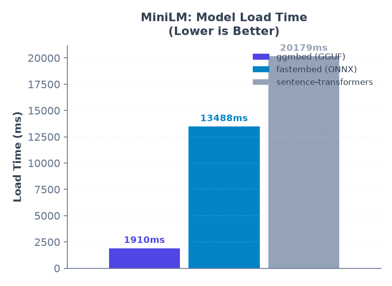
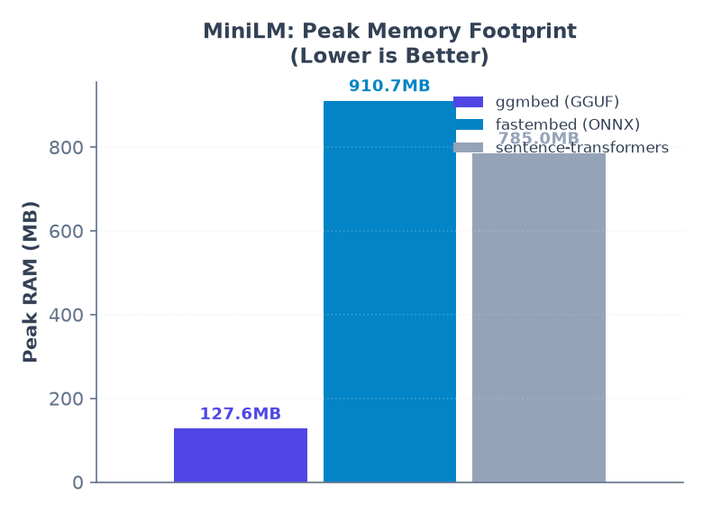
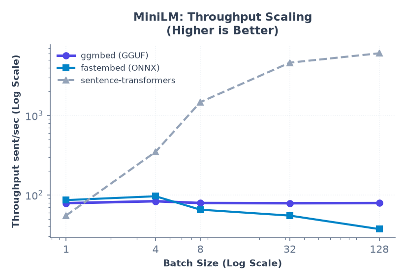
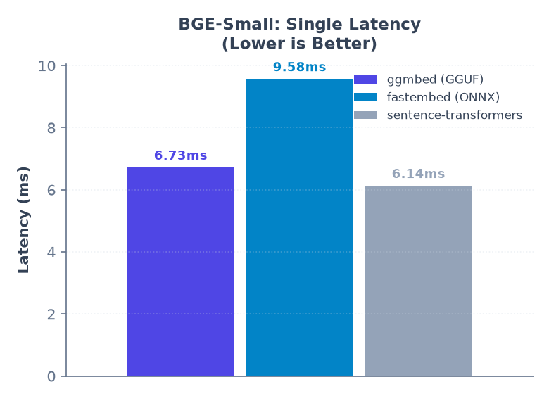
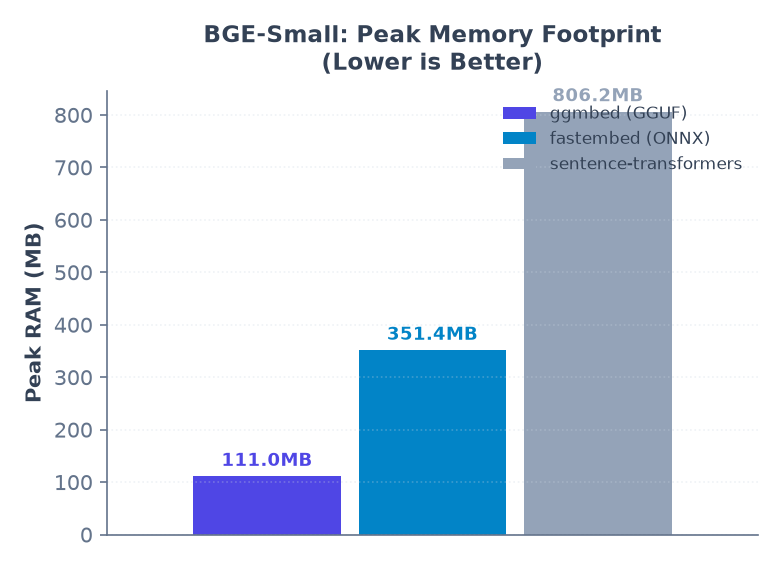
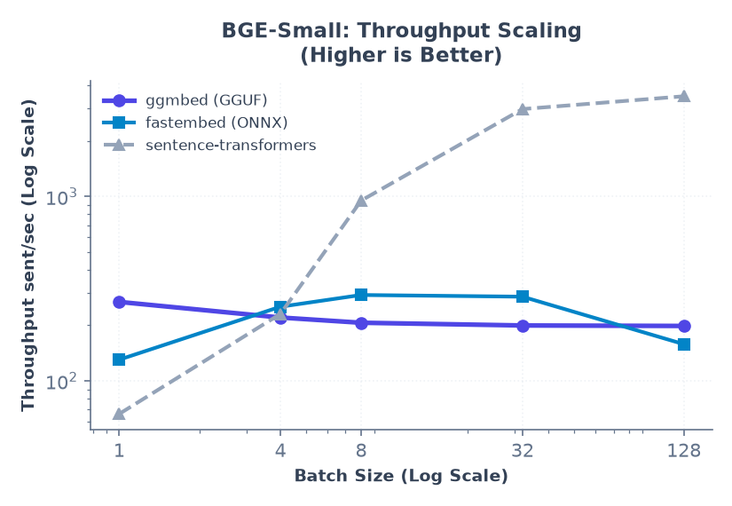

# ggmbed

[](https://pypi.org/project/ggmbed/)
[](https://github.com/thlurte/ggmbed/actions/workflows/publish.yml)
[](https://pypi.org/project/ggmbed/)
[](https://pypi.org/project/ggmbed/)
[](https://pypi.org/project/ggmbed/)
[](https://opensource.org/licenses/MIT)

A lightweight, zero-PyTorch, zero-ONNX-Runtime dense embedding inference engine. Uses a native C++ extension (`llama.cpp` native acceleration) to encode text extremely fast without pulling in gigabytes of deep learning dependencies.

## Install

```bash
pip install ggmbed
```

Only runtime dependencies are `numpy` and `huggingface-hub`.

## Usage

```python
from ggmbed import Embedder

# Initializes the encoder, downloading the optimized Q8_0 quantized all-MiniLM-L6-v2 GGUF model automatically
model = Embedder("sentence-transformers/all-MiniLM-L6-v2")

embeddings = model.encode(["What is a dense embedding?", "It's extremely fast and lightweight."])
print(embeddings.shape)  # (2, 384)

# Load BAAI General Embedding model (auto-resolves to GGUF and uses CLS pooling)
bge_model = Embedder("BAAI/bge-small-en-v1.5")
bge_embeddings = bge_model.encode(["BAAI General Embedding models use CLS pooling."])
```

You can also point it at a local directory containing a `.gguf` file or directly to a `.gguf` file path:

```python
model = Embedder("./my-local-model-directory/")
# OR
model = Embedder("./models/all-MiniLM-L6-v2-Q8_0.gguf")
```

### Supported Out-of-the-Box Models

The engine automatically handles GGUF model downloading from Hugging Face (`thlurte/*`), caching, and pooling settings for the following pre-quantized models:

- `sentence-transformers/all-MiniLM-L6-v2` (default, Mean Pooling, 384 dimensions)
- `BAAI/bge-small-en-v1.5` (CLS Pooling, 384 dimensions)
- `lightonai/DenseOn` (ModernBERT architecture, CLS Pooling, 768 dimensions)

You can query the list programmatically:

```python
from ggmbed import Embedder

print(Embedder.list_supported_models())
# ['sentence-transformers/all-MiniLM-L6-v2', 'BAAI/bge-small-en-v1.5', 'lightonai/DenseOn']
```

## Configuration Options

- `model_name_or_path`: Local path to a GGUF file or directory, or a Hugging Face Hub model ID (defaults to `"sentence-transformers/all-MiniLM-L6-v2"`).
- `tokenizer_path`: Optional explicit path to `tokenizer.json` (no longer required, as llama.cpp loads vocabulary natively from the GGUF model).
- `num_threads`: Number of CPU threads to use. Defaults to `0` (which automatically detects and uses physical CPU cores, avoiding hyperthreading bottlenecks).
- `quantization`: Preferred quantization format (e.g., `"Q8_0"`, `"F16"`, `"F32"`, `"Q4_0"`). Defaults to `"Q8_0"`.
- `pooling_mode`: Pooling strategy to use (`"mean"` or `"cls"`). Defaults to `None` (which auto-detects based on the model name).

## Benchmarks & Reproducibility

To reproduce the latency and memory footprint (RSS) results, run the benchmark script directly using `uv`:

```bash
uv run --group benchmark python scripts/benchmark.py
```

### Benchmark Results

Below is the live benchmark comparison measured on Linux (AMD64 CPU):

### Model: sentence-transformers/all-MiniLM-L6-v2 (Mean Pooling)

<p align="center">
  
  
  
</p>

| Metric | ggmbed (GGUF Q8_0) | fastembed (ONNX) | sentence-transformers (PyTorch) |
| :--- | :---: | :---: | :---: |
| **Model Load Time** | **1,909.7 ms** | 13,488.1 ms *(7.0x slower)* | 20,179.3 ms *(10.5x slower)* |
| **Peak RAM / Memory** | **127.6 MB** | 910.7 MB *(7.1x heavier)* | 785.0 MB *(6.1x heavier)* |
| **Single Latency (p50)** | **12.32 ms** | 11.91 ms | 3.70 ms |
| **Single Latency (p95)** | **17.31 ms** | 16.95 ms | 7.66 ms |

**Batch Throughput (sentences / second)**

| Batch Size | ggmbed (sent/s) | fastembed (sent/s) | sentence-transformers (sent/s) |
| :---: | :---: | :---: | :---: |
| **1** | **78.8** | 86.1 | 55.1 |
| **4** | **83.4** | 96.3 | 348.3 |
| **8** | **79.1** | 65.3 | 1,469.5 |
| **32** | **78.7** | 55.0 | 4,608.6 |
| **128** | **79.0** | 37.2 | 6,053.3 |

### Model: BAAI/bge-small-en-v1.5 (CLS Pooling)

<p align="center">
  
  
  
</p>

| Metric | ggmbed (GGUF Q8_0) | fastembed (ONNX) | sentence-transformers (PyTorch) |
| :--- | :---: | :---: | :---: |
| **Model Load Time** | **1,700.3 ms** | 11,263.5 ms *(6.6x slower)* | 18,336.6 ms *(10.7x slower)* |
| **Peak RAM / Memory** | **111.0 MB** | 351.4 MB *(3.1x heavier)* | 806.2 MB *(7.2x heavier)* |
| **Single Latency (Mean)** | **6.73 ms** | 9.58 ms | 6.14 ms |
| **Single Latency (p50)** | **6.65 ms** | 9.60 ms | 4.95 ms |
| **Single Latency (p95)** | **9.20 ms** | 12.57 ms | 13.03 ms |

**Batch Throughput (sentences / second)**

| Batch Size | ggmbed (sent/s) | fastembed (sent/s) | sentence-transformers (sent/s) |
| :---: | :---: | :---: | :---: |
| **1** | **268.0** | 130.2 | 66.1 |
| **4** | **220.5** | 252.4 | 230.7 |
| **8** | **206.6** | 292.2 | 949.7 |
| **32** | **199.7** | 286.1 | 2,979.9 |
| **128** | **198.5** | 158.1 | 3,496.5 |


## Advanced: Compile from Source (Hardware Acceleration)

By default, pre-built binary wheels are compiled with native SIMD instructions (AVX2/AVX-512/ARM NEON) for maximum CPU portability. If you are compiling from source and want to link against optimized system BLAS backends, pass the appropriate CMake arguments during installation:

- **AMD / Generic CPUs (OpenBLAS)**:
  ```bash
  CMAKE_ARGS="-DGGML_OPENBLAS=ON" pip install --no-binary :all: ggmbed
  ```
- **Intel CPUs (Intel MKL / oneDNN)**:
  ```bash
  CMAKE_ARGS="-DGGML_MKL=ON" pip install --no-binary :all: ggmbed
  ```

## Features

- **GGUF-Native**: Avoids PyTorch and ONNX Runtime entirely.
- **Hardware Optimized**: Compiled with native SIMD instructions (AVX2/AVX-512/ARM NEON) and Flash Attention support.
- **Dynamic Threading**: Auto-detects physical CPU cores to prevent runtime CPU thread thrashing.
- **Highly Portable**: No complex system level dependencies, builds easily on macOS, Linux, and Windows.

## License

MIT. See [LICENSE](LICENSE).
